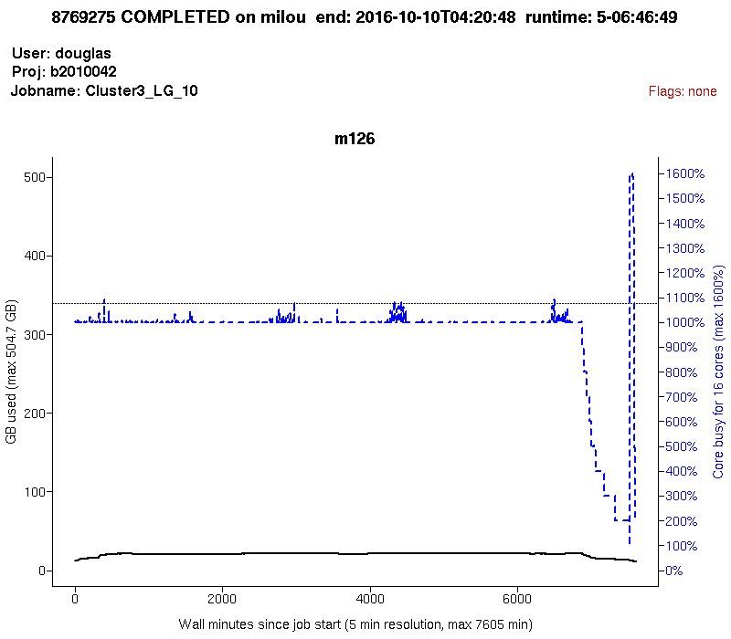

Discovering job statistics with `jobstats`
==========================================

UPPMAX provides `jobstats` to enable discovery of resource usage for jobs submitted
to the SLURM job queue.

    jobstats  -p [ -r ] [ -M cluster ] [options] [ jobid [ jobid ... ] | -A project | - ]

With the `-p`/`--plot` option, a plot is produced from the jobstats for each
jobid.  Plots contain one panel per booked node showing CPU (blue) and memory
usage (black) traces and include text lines indicating the job number, cluster,
end time and duration, user, project, job name, and usage flags (more on those
below).  For memory usage, one or two traces are shown: the solid black line
shows instantaneous memory usage, and (if available) the dotted black line
shows overall maximum memory usage.

Plots are saved to the current directory with the name

    cluster-project-user-jobid.png

An example plot, this was named `milou-b2010042-douglas-8769275.png`:



For multiple-node jobs, plots have a two-column format.

Note that not all jobs will produce jobstats files, particularly if the job was
cancelled or ran for less than 5 minutes.  Also, if a job booked nodes
inefficiently by not using nodes it asked for, jobstats files will not be
available for the booked but unused nodes.  In this case the plot will contain
a blank panel for each such node together with the message 'node booked but
unused'.

Modes of jobstats discovery
===========================

There are five modes for discovery, depending on what the user provides on the
command line: (1) discovery by job number for a completed job; (2) discovery by
job number for a currently running job; (3) discovery by node and job number,
for a completed or running job; (4) discovery by project; or (5) discovery via
information provided on `stdin`.  In of the example command lines below, the
`-p`/`--plot` option requests that plots of job resource usage are created.

**Mode 1:**  `jobstats -p jobid1 jobid2 jobid3`

The job numbers valid on the cluster.  `finishedjobinfo` is used to determine
further information for each job.  This can be rather slow, and a message
asking for your patience is printed for each job.  If multiple queries are
expected it would be quicker to run `finishedjobinfo` yourself separately, see
Mode 4 below.  See Mode 2 for a currently running job.

**Mode 2:**  `jobstats -p -r jobid1 jobid2 jobid3`

Job numbers of jobs currently running on the cluster.  The SLURM `squeue` tool
is used to determine further information for each running job.

**Mode 3:**  `jobstats -p -n m15,m16 jobid`

`finishedjobinfo` is *not* called and Uppmax's stored job statistics files for
the cluster of interest are discovered directly.  If you know which node(s)
your job ran on or which nodes you are interested in, this will be much faster
than Mode 1.

**Mode 4:**  `jobstats -p -A project`

When providing a project name that is valid for the cluster, `finishedjobinfo`
is used to determine further information on jobs run within the project.  As
for Mode 1, this can be rather slow, and a message asking for your patience is
printed.  Furthermore only `finishedjobinfo` defaults for time span etc. are
used for job discovery.  If multiple queries are expected or additional
`finishedjobinfo` options are desired, see Mode 5 below.

**Mode 5:**  `finishedjobinfo -q project | jobstats - -p`

Accept input on stdin formatted like `finishedjobinfo` output.  Note the single
dash `-` option given to `jobstats`; the long form of this option is `--stdin`.
This mode can be especially useful if multiple queries of the same job
information are expected.  In this case, save the output of a single
comprehensive `finishedjobinfo` query, and extract the parts of interest and
present them to this script on stdin.  For example, to produce analyses of all
completed jobs in a project during the current calendar year, and produce
separate tarballs analysing all jobs and providing jobstats plots for each user
during this same period:

```bash
project=myproj
finishedjobinfo -q -y ${project} > ${project}-year.txt
grep 'jobstat=COMPLETED' ${project}-year.txt | jobstats - > ${project}-completed-jobs.txt
for u in user1 user2 user3 ; do
    grep "username=${u}" ${project}-year.txt | jobstats - -p > ${u}-jobs.txt
    tar czf ${u}-jobs.tar.gz ${u}-jobs.txt *-${project}-${u}-*.png
done
```


Command-Line Options
====================

`jobstats -h` may be specified to get detailed help including a complete list
of command line options.

~~~~
    -p | --plot        Produce CPU and memory usage plot for each jobid

    -r | --running     Jobids are for jobs currently running on the cluster. The
                       SLURM squeue tool is used to discover further information
                       for the running jobs, and the rightmost extent of the plot
                       produced will reflect the scheduled end time of the job.

    -A project         Project valid on the cluster.  finishedjobinfo is used to
                       discover jobs for the project.  See further comments
                       under 'Mode 4' above.

    -M cluster         Cluster on which jobs were run [default current cluster]

    -n node[,node...]  Cluster node(s) on which the job was run.  If specified,
                       then the finishedjobinfo script is not run and discovery
                       is restricted to only the specified nodes.  Nodes can be
                       specified as a comma-separated list of complete node
                       names, or using the finishedjobinfo syntax:
                             m78,m90,m91,m92,m100  or  m[78,90-92,100]
                       Nonsensical results will occur if the syntaxes are mixed.

    - | --stdin        Accept input on stdin formatted like finishedjobinfo
                       output.  The short form of this option is a single dash
                       '-'.

    -m | --memory      Always include memory usage flags in output.  Default
                       behaviour is to include memory usage flags only if CPU
                       usage flags are also present.

    -v | --verbose     Be wordy when describing flag values.

    -b | --big-plot    Produce 'big plot' with double the usual dimensions.
                       This implies '-p/--plot'.

    -q | --quiet       Do not produce table output

    -Q | --Quick       Run finishedjobinfo with the -q option, which is slightly
                       faster but does not include SLURM's record of maximum
                       memory used. With this option, memory usage analyses can
                       only rely upon what is reported at 5-minute intervals,
                       and the trace of maximum memory used (dotted black line)
                       is not produced.

    -d                 Produce a header for table output

    -h | --help | -?   Produce detailed help information

~~~~


Additional Options
=================

The following command-line options are generally only useful for Uppmax staff.

    --cpu-free FLOAT   Maximum CPU busy percentage for the CPU to count as
                       free at that sampling time.  Default is 3 %.
    -x directory       Directory prefix to use for jobstats files.  Default is
                       '/sw/share/slurm', and directory structure is

                       <prefix>/<cluster>/uppmax_jobstats/<node>/<jobid>

    -X directory       Hard directory prefix to use for jobstats files.
                       Jobstats files are assumed available directly:
                           '<hard-prefix>/<jobid>'
    --no-multijobs     Run finishedjobinfo separately for each jobid, rather
                       than once with all jobids bundled into one -j option
    -f file            finishedjobinfo script
    -P file            plot_jobstats script


Further Details
===============

This script produces two types of output.  If the `-p`/`--plot` command line option is
provided, a plot is created of core and memory usage across the life of the
job.  The name of the file produced has the format:

    cluster-jobid-project-user.png

Unless the `-q`/`--quiet` option is provided, a table is also produces
containing lines with the following tab-separated fields:

    jobid cluster jobstate user project endtime runtime flags booked cores node[,node...] jobstats[,jobstats...] 

Field contents:

* `jobid`    : Job ID
* `cluster`  : Cluster on which the job was run
* `jobstate` : End status of the job: COMPLETED, RUNNING, FAILED, TIMEOUT, CANCELLED
* `user`     : Username that submitted the job
* `project`  : Project account under which the job was run
* `endtime`  : End time of the job (with `-n/--node`, this is `.`)  For running jobs, this is appended with `(sched)` and surrounded with single quotes.
* `runtime`  : Runtime of the job (with `-n/--node`, this is `.`)
* `flags`    : Flags indicating various types of resource underutilizations
* `booked`   : Number of booked cores (with `-n/--node`, this is `.`)
* `cores`    : Number of cores represented in the discovered jobstats files.
* `node`     : Node(s) booked for the job, expanded into individual node names, separated by commas; if no nodes were found, this is `.`.  The nodes for which jobstats files are available are listed first.
* `jobstats` : jobstats files for the nodes, in the same order the nodes are listed, separated by commas; if no jobstats files were discovered, this is `.`

If `-r`/`--running` was used, an additional field is present:

* `timelimit_minutes` : The time limit of the job in minutes

At completion of the script, a brief summary is produced:

    *** No jobstats files found for 25 out of 56 jobs, limited resource usage diagnosis and no plot produced


Flags
=====

An important part of `jobstats` output are usage flags.  These provide
indications that booked resources might have been underused, either processor
cores, or memory, or both.

In both plot and table output, flags are a comma-separated list of cautions
regarding core and/or memory underutilisation.  The appearance of a flag does
not necessarily mean that resources were used incorrectly.  It depends upon the
tools being used and the contents of the SLURM header, and also depends upon
the job profile.  Because usage information is gathered every 5 minutes, higher
transient usage of cores or memory may not be captured in the log files.

Flags most likely to represent real overbooking of resources are
`nodes_overbooked`, `overbooked`, `!!half_overbooked`, `!!severely_overbooked`,
and `!!swap_used`.

For multinode jobs, flags other than `nodes_overbooked` are determined based only
on the usage of the first node.  Multinode jobs require careful analysis so as
to not waste resources unnecessarily, and it is a common mistake among
beginning Uppmax users to book multiple nodes and run tools that cannot use
more than the first.  In this case, `nodes_overbooked` will appear.

Some flags have a threshold below which they appear.  The default format is
generally `flag:value-booked:value-used`.

* `nodes_overbooked : nodes booked : nodes used` : More nodes were booked than used
* `overbooked : % used` : The maximum percentage of booked cores and/or memory that was used (if &lt; 80%)
* `!!half_overbooked` : No more than one-half of both cores and memory of a node was used; consider booking half a node instead.
* `!!severely_overbooked` : No more than one-quarter of both cores and memory of a node was used, examine your job requirements closely.
* `!!swap_used` : Swap storage was used at any point within the job run
* `node_type_overbooked : type booked : type used` : A fat node was requested that was larger than was needed.  This flag may be produced spuriously if SLURM ran the job on a fat node when a fat node was not requested by the user.
* `cores_overbooked : cores booked : cores used` : More cores were booked than used (if &lt; 80%)
* `mem_overbooked : GB booked : GB used` : More memory was available than was used (if &lt; 25% and more than one core).
* `core_mem_overbooked : GB in used cores : GB used` : Less memory was used than was available in the cores that were used (if &lt; 50%).

By default no flags are indicated for jobs with memory-only cautions except for
swap usage, because it is common for jobs to heavily use processor cores
without using a sizable fraction of memory.  Use the `-m`/`--memory` option to
include flags for memory underutilisation when those would be the only flags
produced.

More verbose flags are output with the `-v`/`--verbose` option.

